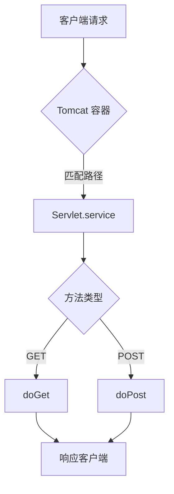

# 开发环境就绪

!!! quote "极速启动"
    在现代软件工程中，配置环境不应成为拦路虎。根据课程“不纠结手动配置”的原则，本课程提供**“一键式集成开发包”**，助你跳过下载外网资源慢、版本冲突等“新手墙”，实现 30 分钟内进入代码编写状态。

---

## 📦 资源下载



请先下载教师提供的 **JavaWeb 实战开发集成包 (2025版)**。

[ :material-download: 点击下载课程集成包 ](https://xunke.wtbu.edu.cn/bmd/bmd-vue/#/platformRouteStation?needBack=1&dist_id=1&platform_uuid=48a6835735d730a19f94ccb8df490a7d&level=4&school_id=1&route_name=guestDiskShare&_fid=504884&_link_id=YMjqQ&_name=JavaWeb实战开发集成包){ .md-button .md-button--primary } [ :material-cloud-download: 百度网盘备用下载 ](https://pan.baidu.com/s/1vDXlY6hU9H0IDxWo6ftZfw?pwd=fpkb){ .md-button }

> 💡 **提示**：百度网盘链接已自带提取码。如需手动输入，请填写提取码：**`fpkb`**。

> **🧰 集成包清单：**
>
> * **JDK**: Oracle JDK 17 (长期支持版)
> * **Build Tool**: Apache Maven 3.9.11
> * **版本控制 (VCS)**: Git 2.52.0 (64-bit)
> * **Web Server**: Apache Tomcat 11.0.15 (用于 Web 底层原理实验)
> * **IDE**: IntelliJ IDEA 2025.2.5 (免安装旗舰版)
> * **Database Tool**: Navicat / DBeaver (可选，IDEA 已内置)
!!! tip "建议目录结构"
    为了避免路径空格带来的莫名其妙的报错，建议在 D 盘新建 `Dev` 文件夹，将所有工具解压到此：
    `D:\Dev\Java`、`D:\Dev\Maven`、`D:\Dev\Idea` 等。

---

## ☕ 第一步：JDK 安装与验证

本课程采用 **Oracle JDK**，这是最常用的版本，兼容性最好。

1.  **解压**：将 `jdk-17.0.12_windows-x64_bin.zip` 解压到 `D:\Dev\Java\jdk-17`。
2.  **配置环境变量**：
    * **新建系统变量** `JAVA_HOME` -> 值：`D:\Dev\Java\jdk-17`
    * **编辑 Path 变量** -> 新建 -> `%JAVA_HOME%\bin`
3.  **验证**：打开 CMD 输入 `java -version`，出现 "Java HotSpot(TM)" 字样即成功。
```bash
java -version
# 输出示例：
#java version "17.0.12" 2024-07-16 LTS
#Java(TM) SE Runtime Environment (build 17.0.12+8-LTS-286)
#Java HotSpot(TM) 64-Bit Server VM (build 17.0.12+8-LTS-286, mixed mode, sharing)
```
---

## 🦁 第二步：Maven 极速配置

Maven 是 Java 项目的“管家”。我们使用预配置版本以加速依赖下载。

1.  **解压**：将 `apache-maven-3.9.11.zip` 解压到 `D:\Dev\Maven`。
2.  **配置环境变量**（这一步不做，命令行无法识别 mvn）：
    * **新建系统变量** `MAVEN_HOME` -> 值：`D:\Dev\Maven\apache-maven-3.9.11`
    * **编辑 Path 变量** -> 新建 -> `%MAVEN_HOME%\bin`
3.  **检查镜像配置**：
    打开 `conf/settings.xml`，确认已包含**阿里云镜像**（集成包已预配，确认即可）：
    ```xml
    <mirror>
      <id>aliyunmaven</id>
      <mirrorOf>central</mirrorOf>
      <name>阿里云公共仓库</name>
      <url>https://maven.aliyun.com/repository/public</url>
    </mirror>
    ```
4.  **验证**：CMD 输入 `mvn -v`，显示 Maven 版本号即成功。
```bash
mvn -v
# 输出示例：
# Apache Maven 3.9.11 (3e54c93a704957b63ee3494413a2b544fd3d825b)
# Maven home:  D:\Dev\Maven
# Java version: 17.0.12, vendor: Oracle Corporation, runtime: D:\Dev\Java\jdk-17
# Default locale: zh_CN, platform encoding: GBK
# OS name: "windows 11", version: "10.0", arch: "amd64", family: "windows"
```
---

## 🐱 第三步：Tomcat 与 Git 配置

这两款工具是 Web 开发的基石。

### 1. Tomcat (Web 服务器)
虽然 Spring Boot 内置了 Tomcat，但在学习 **Servlet 底层原理** 章节时，我们需要独立的 Tomcat。
* **解压**：将 `apache-tomcat-11.0.15.zip` 解压到 `D:\Dev\Tomcat` 即可，暂无需配置环境变量。

### 2. Git (版本控制)
* **安装**：运行 `Git-2.52.0-64-bit.exe`，一路点击 "Next" 直到安装完成。
* **自报家门 (关键)**：
    Git 需要知道“你是谁”才能记录提交。打开 CMD 或 Git Bash，执行以下命令：
    ```bash
    git config --global user.name "你的姓名"  # 例如: ZhangSan
    git config --global user.email "你的邮箱" # 例如: zs@wtbu.edu.cn
    ```
* **验证**：CMD 输入 `git --version`。
```bash
git --version
# 输出示例：
# git version 2.52.0.windows.1
```
---


### 2. 全局配置 (关键!)
在 IDEA 欢迎界面（不要打开项目），点击 **Customize -> All settings...** 进行全局设置，这样以后新建项目都不用重复配置：

* **Maven 设置**：
    * 搜索 "Maven"。
    * `Maven home path`: 选择 `D:/Dev/Maven/apache-maven-3.9.11`。
    * `User settings file`: 勾选 Override，选择 `D:/Dev/Maven/.../conf/settings.xml`。
* **JDK 设置**：
    * 搜索 "Project Structure" (或 SDK)。
    * 在 Platform Settings -> SDKs 中，点击 `+`，添加你的 Dragonwell JDK。

### 3. 安装必备插件 (Plugins)

IntelliJ IDEA 的强大离不开插件生态。为了统一开发规范，请务必安装以下插件。

**🚀 快速安装指南：**

先在欢迎界面点击 **Plugins**（或在项目中按快捷键 `Ctrl + Alt + S` 打开设置 -> Plugins），然后选择以下一种方式：

=== "📦 方式一：离线安装 (推荐)"
    > 由于校园网可能不稳定，**强烈建议**使用此方式安装教师提供的离线包。

    1.  点击顶部的齿轮图标 ⚙️。
    2.  选择 **Install Plugin from Disk...** (从磁盘安装)。
    3.  导航到课程集成包的 `Plugins` 文件夹。
    4.  选中对应的 `.zip` 或 `.jar` 文件，点击 OK。

=== "🌐 方式二：在线安装"
    1.  点击顶部的 **Marketplace** (市场) 标签。
    2.  在搜索框输入插件名称（如 `Lombok`）。
    3.  找到对应的插件，点击绿色的 **Install** 按钮。
    4.  等待下载进度条完成。
<br/>
**✅ 必装插件清单：**

| 插件名称 (搜英文名) | 核心作用 | 为什么必须装？ |
| :--- | :--- | :--- |
| **TONGYI Lingma** | **AI 编程助手** | **课程核心工具。** 阿里通义灵码（也可选 Qoder），它是你的 AI 结对编程伙伴，负责解释代码和生成单元测试。 |
| **MyBatisX** | **框架增强** | **开发效率神器。** 它在 Mapper 接口和 XML 配置文件之间加了“小鸟图标”，点击即可互相跳转，不再需要全屏找代码。 |
| **Translation** | **翻译工具** | **新手救星。** 遇到英文报错看不懂？选中文字 -> 右键 Translate，原地显示中文翻译。 |

!!! warning "避坑提示"
    * **重启生效**：插件安装完成后，IDE 右下角通常会提示 **Restart IDE**，必须重启软件后插件功能才会激活。
    * **版本兼容**：如果你自己下载插件，请务必注意插件版本要与 IDEA 版本（2025.2）匹配，否则无法安装。使用集成包里的文件可避免此问题。
---

## 🔌 第五步：连接 MySQL 数据库

本课程使用的是最经典的 **MySQL** 数据库。
**教室所有电脑已预装 MySQL 服务**，开机即启动，无需你自己安装。

**🔗 IDEA 连接步骤：**

1. 打开 IDEA 右侧侧边栏的 **Database** 面板。
2. 点击 `+` 号 -> `Data Source` -> `MySQL`。
3. **填写连接参数**（请牢记以下信息）：
    * **Host (主机)**：`localhost` (本机)
    * **User (用户)**：`root`
    * **Password (密码)**：通常为 `123456` 或空 (具体请听老师当堂说明)
    * **Database (数据库)**：可以先填空，连接后再创建

4. **下载驱动**：
    * 如果第一次使用，IDEA 底部会提示 "Missing driver files"，点击蓝色的 **Download** 链接，IDEA 会自动下载 MySQL JDBC 驱动。


5. 点击 **Test Connection**。
    * 如果显示绿色的 <span style="color:green">**Succeeded**</span>，恭喜你，数据库连接成功！


## 🧪 验证一切是否就绪

创建一个最简单的 Spring Boot 项目来测试环境（或者直接使用实验1提供的 `demo-start` 工程）。

1.  **新建项目**：生成器 - Spring Boot。
2.  **依赖选择**：Spring Web, Lombok。
3.  **编写代码**：
    ```java
    @RestController
    public class HelloController {
        @GetMapping("/hello")
        public String say() {
            return "Hello JavaWeb! AI is ready!";
        }
    }
    ```
4.  **运行**：点击 Run。
5.  **访问**：浏览器打开 `http://localhost:8080/hello`。

!!! success "通关标志"
    如果你能在浏览器看到 **"Hello JavaWeb! AI is ready!"**，并且你的 IDEA 右侧边栏能唤出 AI 助手对话框，那么恭喜你——**你的环境配置已达满分！**

