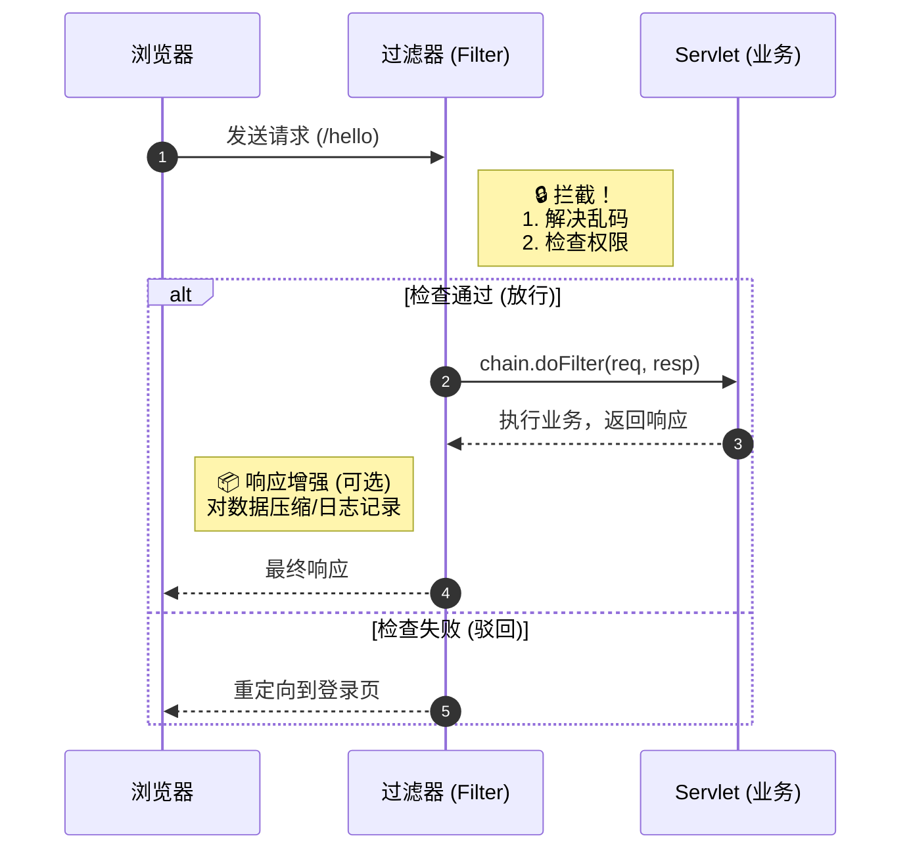
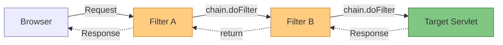

# Web 核心组件：过滤器与监听器 (Filter & Listener)

!!! quote "本节目标"
    在之前的学习中，我们是一个个独立的 Servlet 在战斗。但在大型系统中，我们需要**全局管控**的能力：
    
    1.  **Filter (过滤器)**：Web 应用的**“安保系统”**。统一处理乱码、拦截未登录用户、解决跨域问题。
    2.  **Listener (监听器)**：Web 应用的**“监控摄像头”**。自动记录谁上线了、服务器什么时候启动的。

---

## 🛡️ 第一步：Filter (过滤器) 基础

**Filter** 是 Java Web 中最强大的组件之一。它就像是小区门口的**保安**。
任何请求到达 Servlet 之前，都必须先经过 Filter 的检查；响应返回给用户之前，Filter 也可以进行二次处理。

### 1. 核心工作流程



### 2. 实战场景 A：全站解决中文乱码

再也不用在每个 Servlet 里写 `setCharacterEncoding` 了！

```java title="EncodingFilter.java"
@WebFilter("/*") // "/*" 表示拦截所有请求
public class EncodingFilter implements Filter {
    
    @Override
    public void doFilter(ServletRequest req, ServletResponse resp, FilterChain chain) 
            throws IOException, ServletException {
        
        // --- 1. 请求到达 Servlet 之前执行 (前置处理) ---
        req.setCharacterEncoding("UTF-8");
        resp.setContentType("text/html;charset=UTF-8");
        System.out.println("Filter: 编码已设置，准备放行...");

        // --- 2. 放行 (关键！) ---
        // 如果不写这行，请求就死在这里了，永远到不了 Servlet
        chain.doFilter(req, resp);
        
        // --- 3. Servlet 执行完之后执行 (后置处理) ---
        System.out.println("Filter: Servlet 执行完毕，响应已返回。");
    }
}

```

!!! warning "千万别忘了放行"
    新手常犯错误：写了 Filter 逻辑，却忘了调用 `chain.doFilter(req, resp)`。
    **结果**：页面一片空白，Servlet 根本没执行。

---

## 🔗 第二步：过滤器链 (Filter Chain) 图解

在真实项目中，我们通常会有多个过滤器（编码 Filter -> 登录 Filter -> 跨域 Filter）。它们会形成一条**责任链**。

请求像**穿糖葫芦**一样依次穿过，响应则原路返回。



**执行顺序**：在使用 `@WebFilter` 注解时，执行顺序通常由类名的字母顺序决定（但这不可靠）。如果需要严格控制顺序（比如必须先解决乱码，再验证登录），建议使用 `web.xml` 配置 `<filter-mapping>` 的先后顺序。

---

## 🚧 第三步：实战场景 B - 登录权限拦截

这是 Filter 最经典的用途：**非管理员禁止访问后台**。

**逻辑**：
用户访问 `/admin/*` -> Filter 拦截 -> 检查 Session 有没有 "user" -> 有则放行，无则踢回登录页。

```java title="AdminFilter.java"
// 只拦截 /admin/ 下的所有路径
@WebFilter("/admin/*") 
public class AdminFilter implements Filter {
    @Override
    public void doFilter(ServletRequest request, ServletResponse response, FilterChain chain) 
            throws IOException, ServletException {
        
        HttpServletRequest req = (HttpServletRequest) request;
        HttpServletResponse resp = (HttpServletResponse) response;

        // 1. 获取 Session 中的用户
        Object user = req.getSession().getAttribute("loginUser");

        // 2. 判断
        if (user != null) {
            chain.doFilter(req, resp); // 已登录，放行
        } else {
            // 未登录，重定向到登录页
            resp.sendRedirect(req.getContextPath() + "/login.html");
        }
    }
}

```

---

## 🌍 第四步：实战场景 C - 跨域设置 (CORS)

**这是现代前后端分离开发（Vue/React + Java）的必备技能。**

前端在 `http://localhost:8080`，后端在 `http://localhost:8081`。浏览器处于安全考虑，默认会拦截这种“跨域请求”。
最优雅的解决办法，是在 Filter 中统一给响应头加上“通行证”。

```java title="CorsFilter.java"
@WebFilter("/*")
public class CorsFilter implements Filter {
    @Override
    public void doFilter(ServletRequest req, ServletResponse res, FilterChain chain) 
            throws IOException, ServletException {
        
        HttpServletResponse response = (HttpServletResponse) res;
        
        // 允许来自任何域名的请求访问 (生产环境建议改为指定域名)
        response.setHeader("Access-Control-Allow-Origin", "*");
        // 允许的请求方法
        response.setHeader("Access-Control-Allow-Methods", "POST, GET, OPTIONS, DELETE");
        // 允许携带的请求头
        response.setHeader("Access-Control-Allow-Headers", "Content-Type, Authorization");
        // 预检请求的缓存时间 (秒)
        response.setHeader("Access-Control-Max-Age", "3600");

        chain.doFilter(req, res);
    }
}

```

---

## 👂 第五步：Listener (监听器)

**Listener** 就像是潜伏在系统里的“间谍”或“观察者”。它不主动干活，而是**监听**某个事件（比如服务器启动、Session 创建），一旦事件发生，它就自动触发代码。

### 1. 常用监听器一览

| 监听器接口 | 监听事件 | 典型用途 |
| --- | --- | --- |
| **ServletContextListener** | 项目启动 / 关闭 | 加载数据库配置、初始化全局资源 |
| **HttpSessionListener** | Session 创建 / 销毁 | **统计在线人数**、记录访问日志 |
| **ServletRequestListener** | 请求开始 / 结束 | 计算请求耗时、流量监控 |

### 2. 实战场景：统计网站在线人数

**原理**：
每当有一个新用户访问（浏览器打开），服务器就会创建一个 Session，触发 `sessionCreated`。
每当用户注销或超时，Session 销毁，触发 `sessionDestroyed`。

```java title="OnlineUserListener.java"
@WebListener
public class OnlineUserListener implements HttpSessionListener {

    // Session 创建时调用 (有人上线了)
    @Override
    public void sessionCreated(HttpSessionEvent se) {
        ServletContext ctx = se.getSession().getServletContext();
        
        // 取出当前人数 (注意判空)
        Integer onlineCount = (Integer) ctx.getAttribute("onlineCount");
        if (onlineCount == null) onlineCount = 0;
        
        // 人数 +1 并存回
        onlineCount++;
        ctx.setAttribute("onlineCount", onlineCount);
        System.out.println("有人上线了！当前在线人数：" + onlineCount);
    }

    // Session 销毁时调用 (有人下线了)
    @Override
    public void sessionDestroyed(HttpSessionEvent se) {
        ServletContext ctx = se.getSession().getServletContext();
        Integer onlineCount = (Integer) ctx.getAttribute("onlineCount");
        
        if (onlineCount != null && onlineCount > 0) {
            onlineCount--;
            ctx.setAttribute("onlineCount", onlineCount);
        }
        System.out.println("有人下线了！当前在线人数：" + onlineCount);
    }
}

```

---

## 🧪 第六步：随堂实验

!!! question "练习：开发一个“敏感词过滤器”"
    **需求**：  
    1.  创建一个 Servlet，接收 `content` 参数并直接打印到页面上。  
    2.  创建一个 Filter，拦截该 Servlet。  
    3.  **功能**：如果参数 `content` 中包含 "笨蛋"、"坏人" 等词汇，不要直接放行，而是输出 "您的评论包含违规内容，已被拦截"。  
    4.  如果内容正常，则放行。  
    **提示**： 在 Filter 中可以使用 `req.getParameter("content")` 检查内容。如果不符合要求，直接 `resp.getWriter().write(...)` 并 `return`（不再调用 `chain.doFilter`）。
---

## 📝 总结

| 组件 | 角色 | 核心代码 | 典型用途 |
| --- | --- | --- | --- |
| **Filter** | **保安** | `chain.doFilter(req, resp)` | **解决乱码**、**登录验证**、**跨域设置(CORS)** |
| **Listener** | **摄像头** | `sessionCreated()` | **在线人数统计**、项目初始化加载 |

**至此，Java Web 原生开发的核心三大件（Servlet, Filter, Listener）你已全部掌握！** 接下来，我们将开始接触数据库，让数据持久化。

[下一节：数据持久化原理 (JDBC & Druid)](07-jdbc-core.md){ .md-button .md-button--primary }
