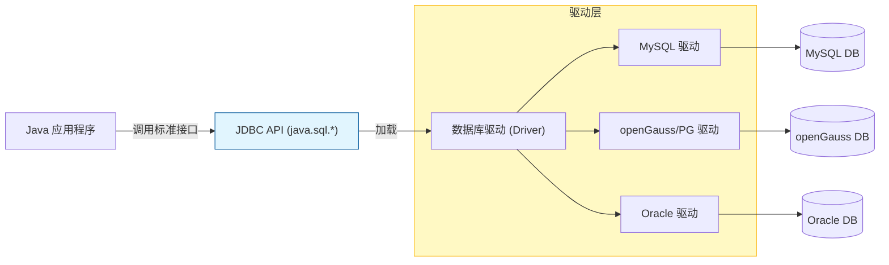

# 7. JDBC 数据库交互基础

!!! quote "本节目标"
    到目前为止，我们的数据（变量、List、Map）都存在**内存**中，服务器重启或断电，数据就丢了。
    
    为了让数据**持久化**，我们需要把数据存入数据库。
    **JDBC (Java Database Connectivity)** 就是 Java 程序通往数据库世界的**“跨海大桥”**。

---

## 🌉 第一步：什么是 JDBC？

我们有 MySQL、Oracle、**openGauss** 等各种数据库，它们的底层指令都不一样。Java 程序员难道要为每种数据库学一套 API 吗？

当然不需要。Java 制定了一套**标准接口 (JDBC)**，各大数据库厂商负责写**实现类 (Driver 驱动)**。

* **Java 程序员**：只学 JDBC 标准接口（遥控器按键）。
* **数据库厂商**：提供 JDBC 驱动包（遥控器内部电路），负责把 Java 指令翻译成数据库能懂的协议。



---

## 📦 第二步：引入依赖 (Maven)

要连接数据库，必须先在 `pom.xml` 中放入对应的驱动包（Jar 包）。
由于本课程使用的是 **openGauss**（兼容 PostgreSQL 协议），我们使用以下依赖：

```xml title="pom.xml"
<dependencies>
    <dependency>
        <groupId>org.postgresql</groupId>
        <artifactId>postgresql</artifactId>
        <version>42.6.0</version>
    </dependency>
</dependencies>

```

---

## 🛠️ 第三步：JDBC 核心五步法 (标准写法)

这是所有数据库操作的“基本功”。无论是查询还是更新，都逃不过这五步。

### 1. 核心 API 一览

* `DriverManager`：**老司机**，负责加载驱动，获取连接。
* `Connection`：**电话线**，代表与数据库的连接通道。
* `PreparedStatement`：**搬运工**，用于发送 SQL 语句（比 Statement 更安全）。
* `ResultSet`：**结果集**，查询返回的表格数据。

### 2. 标准代码模板 (Try-with-resources)

使用 JDK 7+ 的 `try-with-resources` 语法，可以**自动关闭资源**，防止内存泄漏。

```java title="JdbcDemo.java"
import java.sql.*;

public class JdbcDemo {
    public static void main(String[] args) {
        // 数据库配置 (openGauss/PostgreSQL)
        String url = "jdbc:postgresql://localhost:5432/postgres"; // 这里的 postgres 是库名
        String user = "gaussdb"; // 你的数据库账号
        String password = "SecretPassword@123"; // 你的数据库密码

        String sql = "SELECT id, username FROM sys_user WHERE id > ?";

        // ✅ 自动关闭资源写法：Connection, Statement, ResultSet 都会自动 close
        try (
            Connection conn = DriverManager.getConnection(url, user, password);
            PreparedStatement pstmt = conn.prepareStatement(sql)
        ) {
            // 1. 设置参数 (把 SQL 中的 ? 替换为实际值)
            pstmt.setInt(1, 0); // 查询 id > 0 的用户

            // 2. 执行查询 (executeQuery 返回 ResultSet, executeUpdate 返回 int 行数)
            try (ResultSet rs = pstmt.executeQuery()) {
                
                // 3. 处理结果集 (游标默认在第一行之前，next() 下移一行)
                while (rs.next()) {
                    int id = rs.getInt("id");
                    String name = rs.getString("username");
                    System.out.println("ID: " + id + ", User: " + name);
                }
            }
        } catch (SQLException e) {
            e.printStackTrace();
        }
    }
}

```

!!! info "关于 Class.forName"
    在老旧的教材中，你可能会看到 `Class.forName("org.postgresql.Driver")`。  
    **现在不需要了！** JDBC 4.0 以后，Java 会自动发现并加载类路径下的驱动。

---

## 🛡️ 第四步：SQL 注入与 PreparedStatement

这是面试和安全审计的**必考题**。

### ❌ 错误的写法 (Statement)

如果你用**字符串拼接**的方式写 SQL，黑客可以轻松通过输入 `' OR '1'='1` 绕过登录。

```java
// 危险！千万别这么写！
String sql = "SELECT * FROM user WHERE name = '" + inputName + "'";
// 如果 inputName 输入的是：' OR '1'='1
// SQL 变成了：SELECT * FROM user WHERE name = '' OR '1'='1'  -> 永远为真！

```

### ✅ 正确的写法 (PreparedStatement)

`PreparedStatement` 使用 `?` 作为占位符，并对参数进行**预编译**。数据库会把参数仅当作“纯文本”处理，而不会当作指令执行。

```java
String sql = "SELECT * FROM user WHERE name = ?";
pstmt = conn.prepareStatement(sql);
pstmt.setString(1, inputName); // 安全！

```

---

## 🧪 第五步：随堂实验

!!! question "练习：完成用户登录功能"
    **需求**：

    1.  数据库表 `t_user` 结构：`id, username, password`。
    2.  编写一个 `LoginDao` 类，包含方法 `boolean login(String name, String pwd)`。
    3.  **核心逻辑**：
        * 连接数据库。
        * 使用 SQL：`SELECT count(*) FROM t_user WHERE username=? AND password=?`。
        * 如果查询结果 > 0，返回 true，否则返回 false。
    4.  **选做**：在 Servlet 中调用该方法，实现真正的 Web 登录。

    > **💡 提示**：
    > 不要直接存明文密码！实际开发中通常存 MD5 或 BCrypt 加密后的字符串。但为了教学方便，本次实验可暂用明文。

---

## 📝 总结

| 接口/类 | 作用 | 关键方法 |
| --- | --- | --- |
| **DriverManager** | 驱动管理 | `getConnection()` |
| **Connection** | 数据库连接 | `prepareStatement(sql)` |
| **PreparedStatement** | **执行 SQL (防注入)** | `executeQuery()` / `executeUpdate()` |
| **ResultSet** | 结果集 | `next()`, `getInt()`, `getString()` |

**下一步预告**：
每次请求都创建 Connection 太慢了！下一节我们将学习 **DataSource (连接池)** 技术，给数据库连接建一个“共享充电宝站”。

[下一节：数据源与连接池 (DataSource & Druid)](https://www.google.com/search?q=02-datasource-pool.md){ .md-button .md-button--primary }
