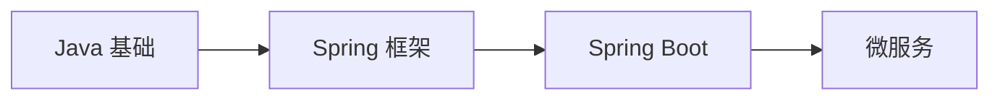
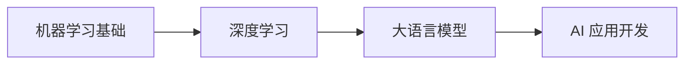

# 学习路线

## Java 开发者路径

```mermaid
graph LR
    A[Java 基础] --> B[Spring 框架]
    B --> C[Spring Boot]
    C --> D[微服务]
```

## AI 工程师路径

```mermaid
graph LR
    A[机器学习基础] --> B[深度学习]
    B --> C[大语言模型]
    C --> D[AI 应用开发]
```

## 学习建议

- 选择一条主线，不要贪多
- 每学完一个阶段，做一个小项目巩固
- 持续学习，保持好奇心
